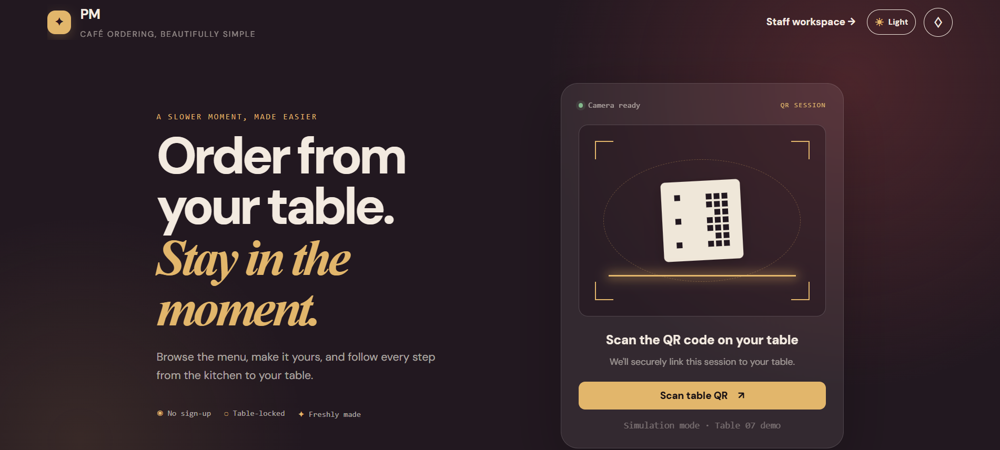
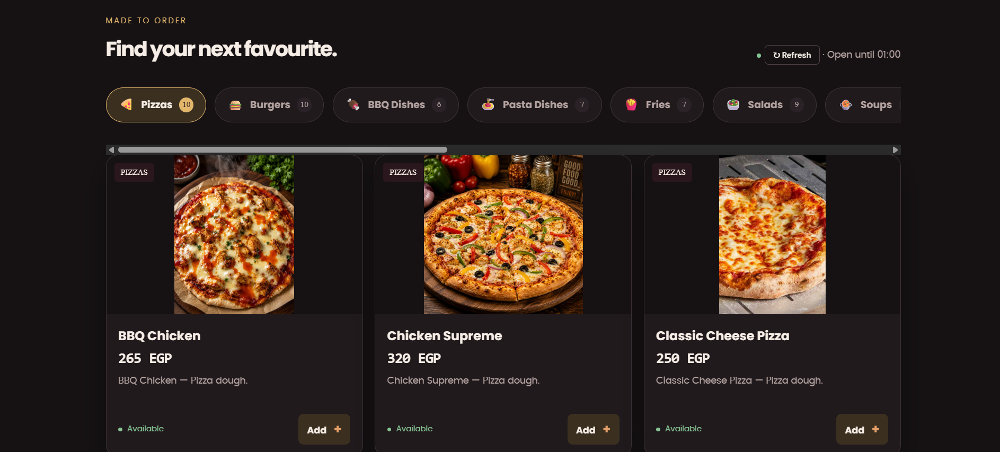
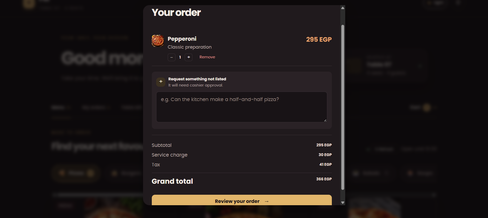
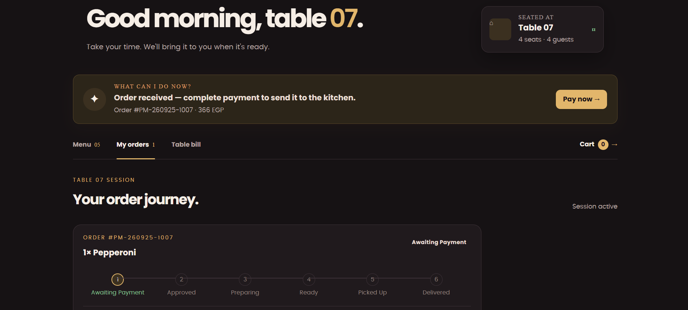
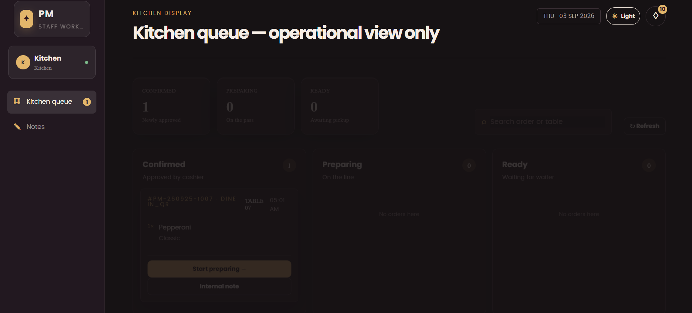
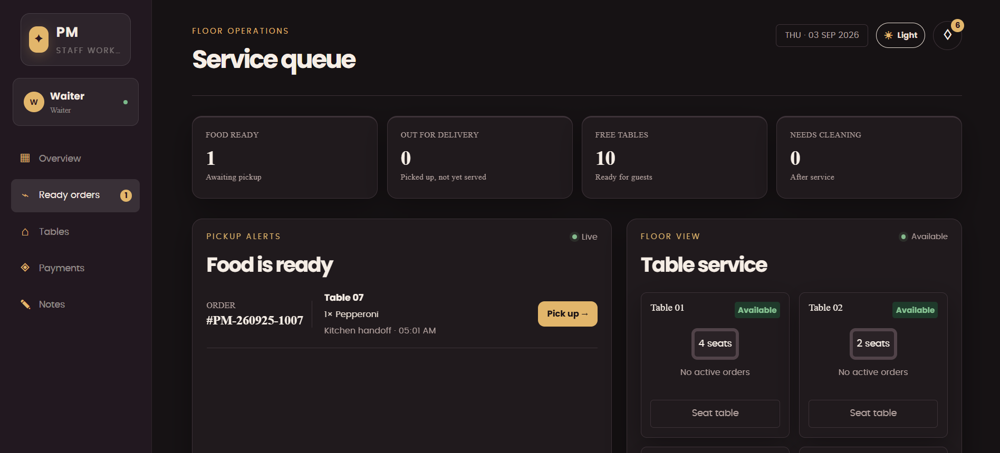
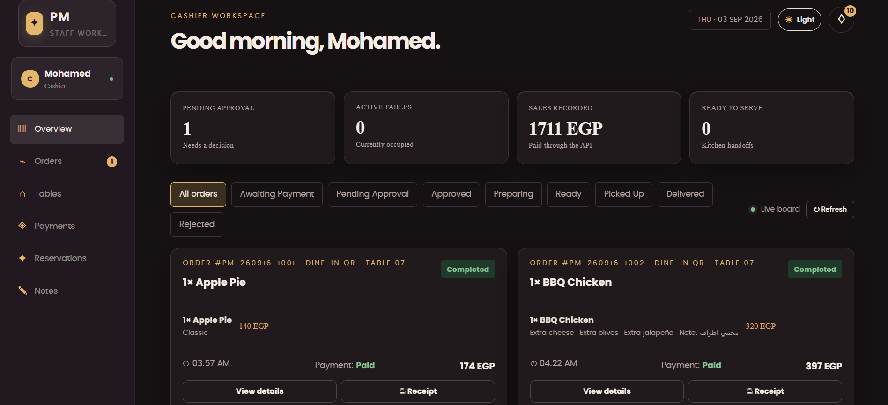
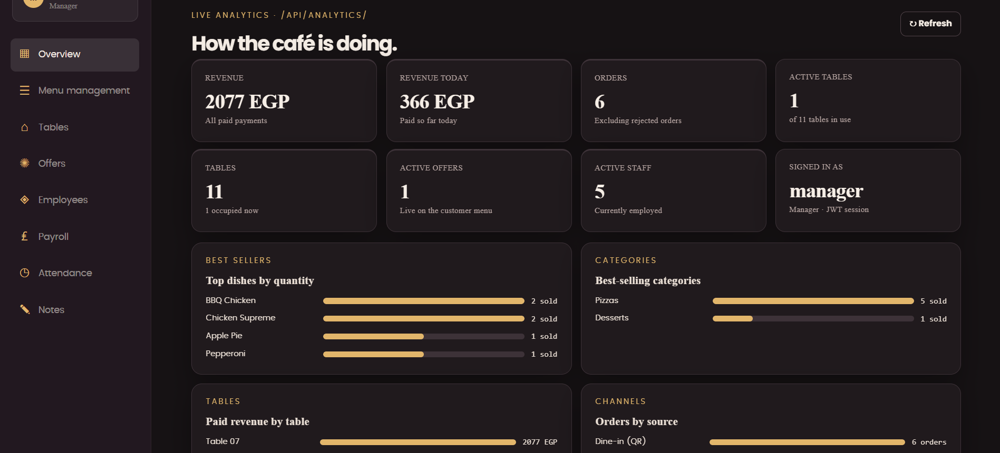
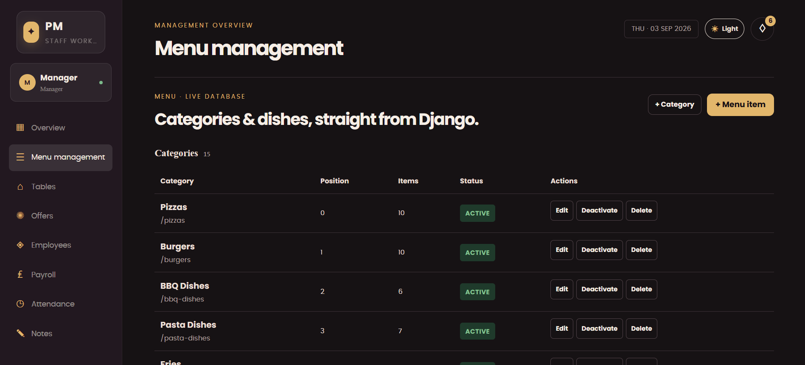
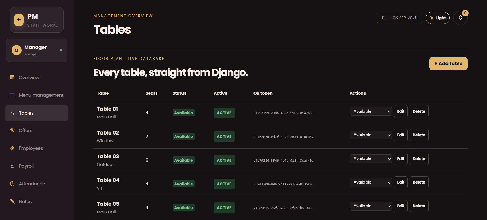

<div align="center">

# 🍽️ PM Café — QR Ordering & Restaurant Management System

**Scan. Order. Track. No waiter required.**

A full self-service restaurant ordering platform: customers scan a QR code at their table, browse a live digital menu, order and pay from their phone — while Kitchen, Cashier, Waiter and Manager each get a dedicated real-time workspace to run the floor.


</div>

---

## 📖 Overview

PM Café replaces the traditional waiter-driven ordering flow with a **QR-based, self-service system**. Every table has a unique QR code; scanning it opens a private session locked to that table only. The customer browses the menu, customizes their order, pays, and tracks it live — while every role in the restaurant (Kitchen, Cashier, Waiter, Manager) has its own screen showing exactly what they need to act on, and nothing else.

The **menu is never hard-coded** in the frontend. Django + PostgreSQL is the single source of truth for every category, product, price, image, ingredient, option, add-on and offer — the frontend simply renders whatever the API returns.

<div align="center">

<br/>
<sub>Landing screen — scanning the table QR opens a private, table-locked ordering session.</sub>
</div>

## ✨ Features

### 👤 Customer

- Scan table QR → private, table-locked ordering session
- Browse categories, product details, ingredients and images
- Customize items with options (sizes) and add-ons
- Cart, custom requests per item, live tax/service total
- Pay online (Stripe Checkout) or via cash/manual wallet at the counter
- Live order tracking with status notifications, no login required
- Light/dark mode, persisted per device

### 👨‍🍳 Kitchen

- Live queue of paid/approved orders only
- Mark items **Preparing → Ready**
- Flag products as sold out in real time
- Internal kitchen notes per order

### 🧾 Cashier

- Record manual payments (cash / InstaPay / Vodafone Cash / card)
- Reject an order pre-payment with a reason (e.g. item unavailable) — customer can edit and resubmit
- Manage event reservations (birthdays, engagements, private gatherings) with table-conflict protection
- Stripe webhook-verified online payments — no payment is ever marked paid by the frontend alone

### 🧑‍🍽️ Waiter

- Table board with live status (Available / Occupied / Waiting food / Food ready / Needs cleaning)
- Pick up ready orders from the kitchen counter and deliver to the table

### 👔 Manager

- Full access to every module above
- Menu, category, offer and pricing management (scheduled & percentage/fixed-price offers)
- Staff accounts, roles, shifts, attendance, salary bonuses/deductions
- QR code generator/visualizer for every table
- Notifications system — broadcast to a role, specific staff, or a customer/table

## 🧭 Order Lifecycle

```
Customer submits  →  AWAITING_PAYMENT
Payment verified   →  APPROVED        (Stripe webhook or Cashier manual entry)
Kitchen starts      →  PREPARING
Kitchen finishes     →  READY
Waiter claims        →  PICKED_UP
Waiter serves          →  DELIVERED
Session closes           →  COMPLETED

                     ⤷ REJECTED (pre-payment only, e.g. item ran out — customer can resubmit)
```

Every transition is written to an audit trail (`OrderStatusHistory`), and every price is **snapshotted** at order time — a later price change by the Manager never rewrites past receipts.

## 🖼️ Menu Photography

A sample of the 170+ real product photos already shipped with the project's seeded catalog:

<div align="center">


</div>

## 📱 App Screens

Real screens from the running system — customer ordering flow, and the Cashier, Kitchen, Waiter and Manager workspaces.

|                   Customer — Menu                    |               Customer — Cart               |                  Order Tracking                  |
| :--------------------------------------------------: | :-----------------------------------------: | :----------------------------------------------: |
|  |  |  |

|                 Kitchen Board                  |             Waiter — Table Board              |                Cashier — Payments                 |
| :--------------------------------------------: | :-------------------------------------------: | :-----------------------------------------------: |
|  |  |  |

|                Manager — Dashboard                 |               Manager — Menu Editor               |         Manager — QR Generator         |
| :------------------------------------------------: | :-----------------------------------------------: | :------------------------------------: |
|  |  |  |

## 🛠️ Tech Stack

| Layer        | Technology                                                       |
| ------------ | ---------------------------------------------------------------- |
| Backend      | Django 5.2, Django REST Framework, Simple JWT                    |
| Database     | PostgreSQL (SQLite for local migration generation only)          |
| Payments     | Stripe Checkout + verified webhooks                              |
| Static/Media | WhiteNoise (static), local media storage                         |
| Frontend     | HTML5, CSS3, TypeScript (compiled to `js/app.js`)                |
| Deployment   | Render (backend + PostgreSQL), Netlify / GitHub Pages (frontend) |

## 📂 Project Structure

```
Cafe_Prpm/
├── index.html
├── css/style.css
├── js/app.js
├── ts/app.ts
├── backend/
│   ├── manage.py
│   ├── requirements.txt
│   ├── pm_cafe/
│   └── cafe/
│       ├── models.py
│       ├── views.py
│       ├── serializers.py
│       ├── permissions.py
│       ├── catalog.py
│       └── middleware.py
└── docs/screenshots/
```

## 🚀 Getting Started

### Backend

```bash
cd backend
python -m venv .venv
.venv\Scripts\activate
pip install -r requirements.txt
python manage.py migrate
python manage.py runserver 8010
```

Copy `backend/.env.example` to `.env` and set your PostgreSQL credentials and (optionally) Stripe test-mode keys.

### Frontend

Just open `index.html` in a browser, or serve the folder with any static server. Make sure `window.PM_API_URL` in `index.html` points to your running backend.

```html
<script>
  window.PM_API_URL = "http://127.0.0.1:8010";
</script>
```

### Windows (one command)

```powershell
./run-local.ps1
```

Starts the frontend on `http://127.0.0.1:5510` and the API on `http://127.0.0.1:8010`.

## 🔐 Roles & Demo Access

| Role         | Access                                      |
| ------------ | ------------------------------------------- |
| **Manager**  | Full system access                          |
| **Cashier**  | Payments, reservations, order rejection     |
| **Kitchen**  | Order queue, preparing/ready, stock         |
| **Waiter**   | Table board, pickup & delivery              |
| **Customer** | No login — scoped by table QR / order token |

## ☁️ Deployment

- **Backend + PostgreSQL:** [Render](https://render.com) — free web service + free PostgreSQL instance
- **Frontend (static files):** Netlify, GitHub Pages, or Render Static Site

See `backend/README.md` for backend-specific environment variables.

## 📸 Updating the screenshots

To refresh any screen later, just overwrite the matching file in `docs/screenshots/` with a new screenshot of the same name (e.g. `manager-dashboard.png`) and push — the README picks it up automatically, no other edits needed.

## 📄 License

Internal project — add a license here if you plan to open-source it.
